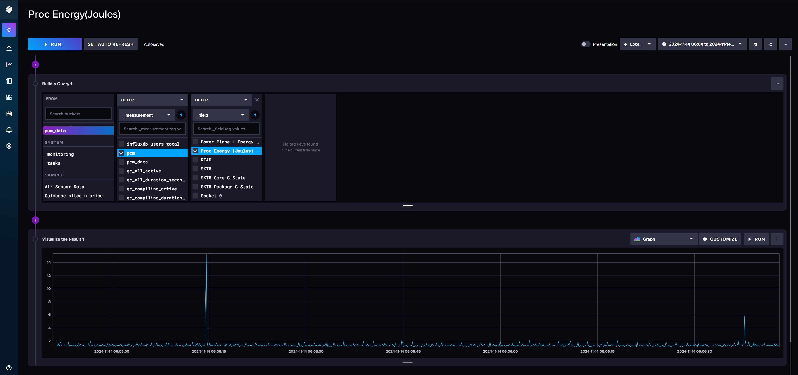

# CPUEnergyEstimation
Research Project for CSEN 283

gcc g++ libacl1-dev libaio-dev libapparmor-dev libatomic1 libattr1-dev libbsd-dev libcap-dev libeigen3-dev libgbm-dev libcrypt-dev libglvnd-dev libipsec-mb-dev libjpeg-dev libjudy-dev libkeyutils-dev libkmod-dev libmd-dev libmpfr-dev libsctp-dev libxxhash-dev zlib1g-dev 